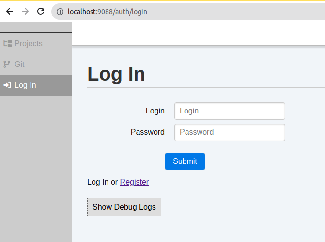
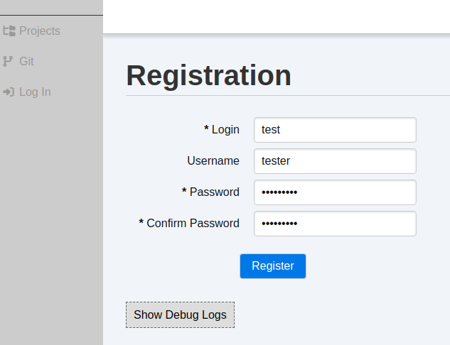
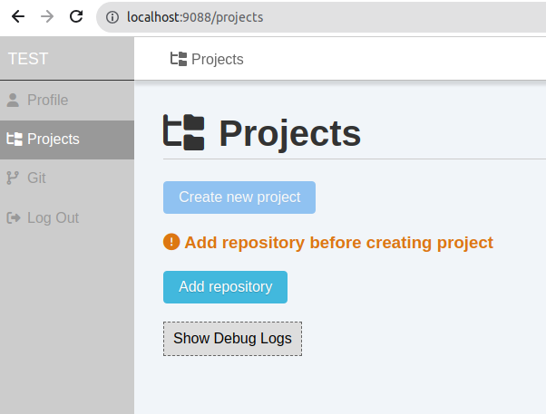
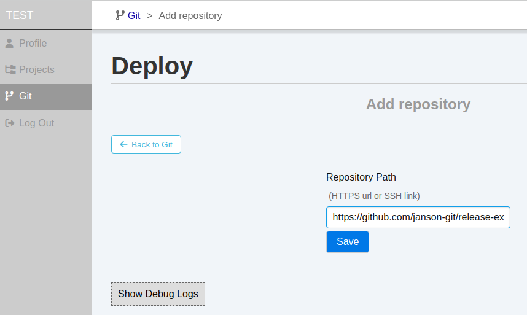
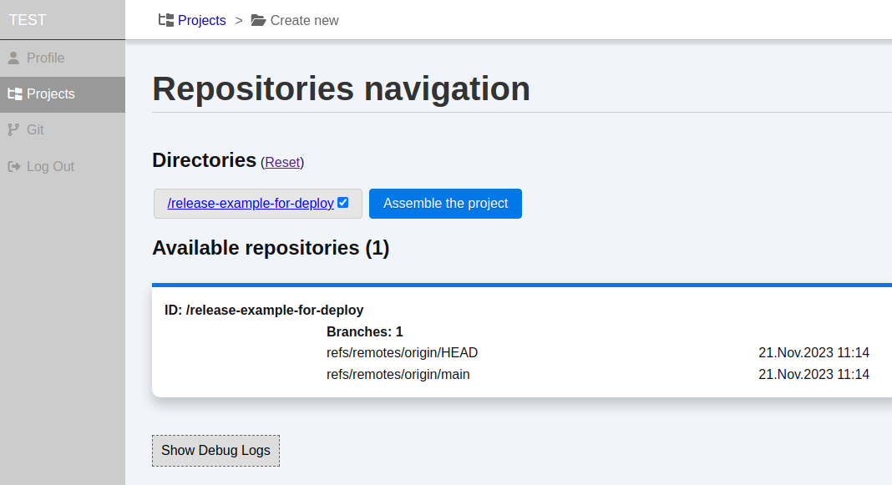
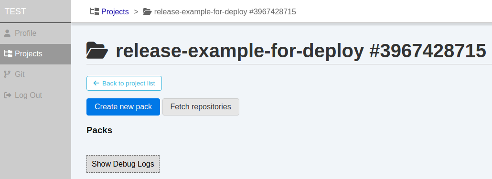
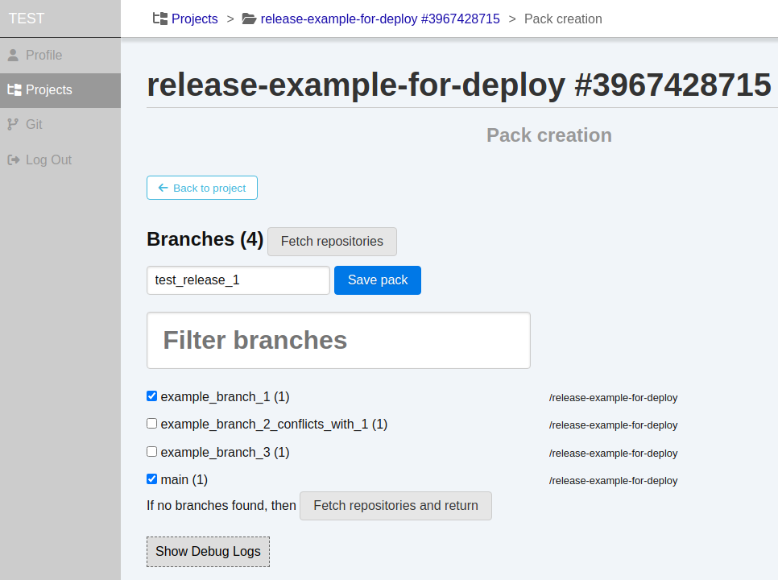

# Usage, example workflow

This document describes simple example of release branch creating. 
I recommend use one of public repositories to testing app.

I will use a [repository](https://github.com/janson-git/release-example-for-deploy.git) that specially created for testing purposes.

## Install the app

#### INSTALL (you need docker and docker-compose)

1. Clone and install `deploy` app
```shell
git clone https://github.com/janson-git/deploy.git
cd deploy
make install
```

or you can make this manually:
```shell
git clone git@github.com:janson-git/deploy.git
cd deploy
cp .env.example .env
docker-compose build
```

This step can get few munutes to build docker-container. It pulls docker image, 
install php with some extensions, composer, and nginx inside of docker container.

2. When build finished successfully, lets start app container.
```shell
make up
```
or
```shell
docker-compose up -d
```
The result of these commands is equal.

3. Open in your browser URL http://localhost:9088. It looks like this:


4. Go to `Register` page and create account (all data stored locally in your app instance)


5. After click `Register`, you redirected to `Projects` page. Now it is empty. 
You need add repository cause of projects are based on repositories. Let's add one.


6. Click on `Add Repository` button, get the page and insert example URL `https://github.com/janson-git/release-example-for-deploy` in field. Then click `Save`


7. After saving you saw the page where new repository presented. Ok, just click to `Projects` link in menu and starts to create new project!
8. Click on `Create new project` button on `Projects` page. The page to create new project looks like this one:

At this page you see:
  - directory list of repositories which already added in app
  - list of repositories and list of branches in each one

This is enabled to go through directories structure and get selected. But it could be helpfull for mono-repositories.
Right now we have a simple repository. Just check it and click on `Asseble the project` button.

Only changes are:
  - list of root directories appeared on page
  - button `Save project` under the list
You are close! Click on `Save project` and see project created!


9. Okay! Right now you need to know one more thing: PACKS. Think about PACK as a PLAN of release. 
You can add repository branches in pack and after merge it created release branch.
See? You create a PLAN and by merge you get all updates in your release branch.

It is convenient because when you have updates in work branches (bugfixes, improvements, fixes by code review)
 you can get all this updates by click on `Merge branches` of your PACK: it gets all branches from PACK list and merge them in release branch.

Let's look at!

10. Create a pack. If you don't see all branches that exists in repo then click on `Fetch repositories` button.
It fetches repository and return to page `Create pack`. Mark by checkboxes all branches that you want to add in release and click `Save pack`


# TODO: FINISH THE HELP!
